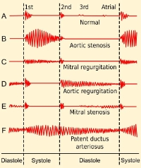

**Biomedical Signal Processing Project**

**Classifying murmurs**

Sorce of the data and the project: Krist´of Muller,¨ Janka Hatvani

Autumn 2022

1  Introduction

In this project you will (hopefully) create a method to classify heartsounds based on if they contain heart murmurs or not. This task was actually given out as an international challenge for researchers, the newly named George B. Moody PhysioNet Challenge [1]. You will work with the same data, but we made your task easier by pre-selecting some of the data. You can use the original complete dataset [2], if you would like, but that is in another format and there are some other differences. All in all it is a bit more complicated to use that, especially based on the varying signal quality.

1\.1 Heart murmurs

Heart murmurs are noises which occur in the heart when the flow of blood is turbulent and not smooth. This can be a symptom of heart problems such as valve stiffness (stenosis) or blood-backflow (regurgitation) which can lead to more serious diseases (for more examples see Figure 1 [3]). These noises can be classified with their pitch, timing, and shape. We usually see murmurs starting at some time during the systole or diastole and lasting for different amounts. Based on these the murmurs can be:

- Early-systolic • Early-diastolic
- Mid-systolic • Mid-diastolic
- Late-systolic • Late-diastolic
- Holo-systolic • Holo-diastolic



Figure 1: Heart murmurs and their causes

2  Project Description

After downloading the dataset, read in the data. It contains two folders for normal and murmur signals (.wav) and their corresponding heartsound labels (.tsv). In the label files the first and the second column is the start and end of the given event (seconds). Each heartcycle event has a number id: 1-S1, 2-systole, 3-S2, 4-diastole, 0-unknown. You can use anything you learned during the semester to implement your methods. The submission accuracies will be evaluated on a hidden testing dataset, but you can validate your process on the provided data.

1. Tasks
1. Research different techniques for PCG processing (spectrum, filtering, features, wavelets, energy, homomorphic envelope etc.)
1. Inspect the database and decide which researched processes can you use.
1. Create a helper function to better visualize the signals and the results.
4. Detect heartsound time locations.
4. Estimate the heartrate for a signal.
4. Separate systole and diastole regions.
4. Show different properties of the signals/segments. Compare regular and abnormal signals. (You can use the features you found during researching)
4. Classify each record as Normal or Murmur. You do not need to differentiate between the murmur types. (PCA, ICA, SVM etc.)
4. Create the documentation and a presentation (∼5 min + questions) for your submission.

The sensitivity and specificity will be calcu- lated as their standard definitions, or to be more exact in the following way:

TP TN Se =~~ , Sp =

TP + FN TN + FP Where each term is defined as in Table 2.

||Murmur|Normal|
| :- | - | - |
|Murmur Predicted|TP|FP|
|Normal Predicted|FN|TN|

Table 2: Classification terms

References

1. M. A. Reyna, Y. Kiarashi, A. Elola, J. Oliveira, F. Renna, A. Gu, E. A. Perez Alday, N. Sadr,
   1. Sharma, S. Mattos, M. T. Coimbra, R. Sameni, A. B. Rad, and G. D. Clifford, “Heart Murmur Detection from Phonocardiogram Recordings: The George B. Moody PhysioNet Challenge 2022,” medRxiv, 2022. [Online]. Available: https://www.medrxiv.org/content/early/2022/08/16/2022.08.1 1.22278688
1. J. Oliveira, F. Renna, P. D. Costa, M. Nogueira, C. Oliveira, C. Ferreira, A. Jorge, S. Mattos,
   1. Hatem, T. Tavares, A. Elola, A. B. Rad, R. Sameni, G. D. Clifford, and M. T. Coimbra, “The CirCor DigiScope Dataset: From Murmur Detection to Murmur Classification,” IEEE Journal of Biomedical and Health Informatics, vol. 26, no. 6, pp. 2524–2535, 2022.
1. “File:Phonocardiograms from normal and abnormal heart sounds.svg,” https://commons.wikime dia.org/wiki/File:Phonocardiograms from~~ normal~~ and abnormal~~ heart sounds.svg, accessed: 2022-11-01.

